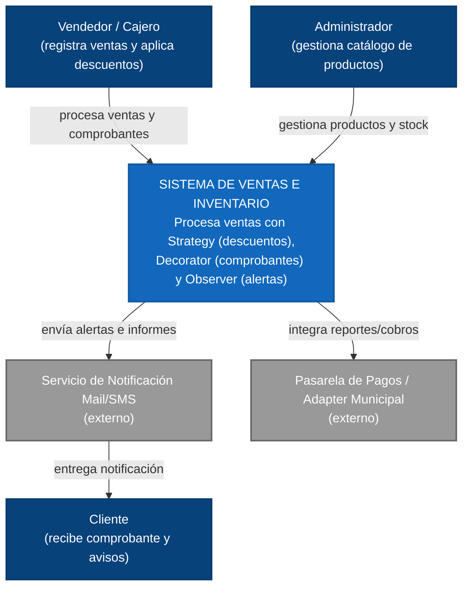

## Nivel 1 

```mermaid
graph TD
    classDef actor fill:#08427b,color:#fff,stroke:#073b6f,stroke-width:2px;
    classDef system fill:#1168bd,color:#fff,stroke:#0e58a0,stroke-width:2px;
    classDef external fill:#999999,color:#fff,stroke:#666666,stroke-width:2px;

    vendedor["Vendedor / Cajero<br/>(registra ventas y aplica descuentos)"]:::actor
    admin["Administrador<br/>(gestiona catálogo de productos)"]:::actor
    cliente["Cliente<br/>(recibe comprobante y avisos)"]:::actor

    sistema["SISTEMA DE VENTAS E INVENTARIO<br/>Procesa ventas con Strategy (descuentos),<br/>Decorator (comprobantes) y Observer (alertas)"]:::system

    correo["Servicio de Notificación Mail/SMS<br/>(externo)"]:::external
    pasarela["Pasarela de Pagos / Adapter Municipal<br/>(externo)"]:::external

    vendedor -->|procesa ventas y comprobantes| sistema
    admin -->|gestiona productos y stock| sistema
    sistema -->|envía alertas e informes| correo
    correo -->|entrega notificación| cliente
    sistema -->|integra reportes/cobros| pasarela
```