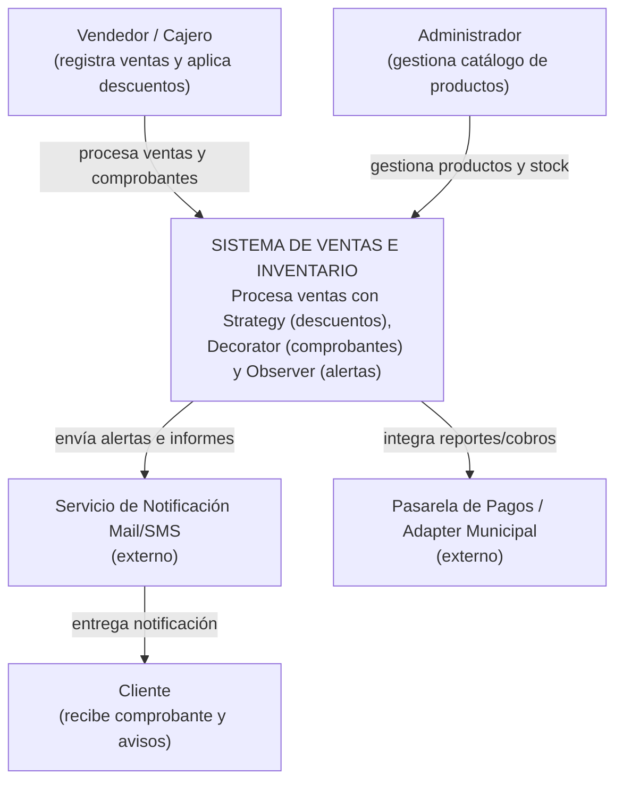
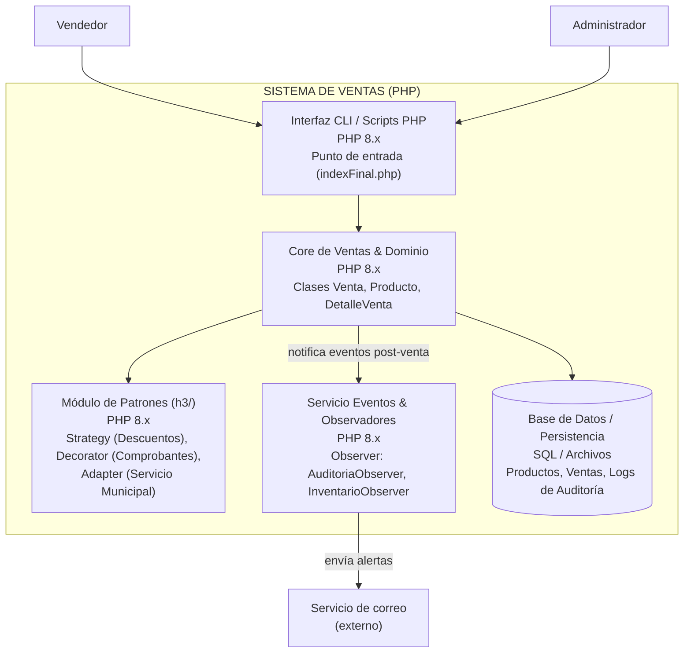

## Nivel 1 

```mermaid
graph TD
    vendedor["Vendedor / Cajero<br/>(registra ventas y aplica descuentos)"]:::actor
    admin["Administrador<br/>(gestiona catálogo de productos)"]:::actor
    cliente["Cliente<br/>(recibe comprobante y avisos)"]:::actor

    sistema["SISTEMA DE VENTAS E INVENTARIO<br/>Procesa ventas con Strategy (descuentos),<br/>Decorator (comprobantes) y Observer (alertas)"]:::system

    correo["Servicio de Notificación Mail/SMS<br/>(externo)"]:::external
    pasarela["Pasarela de Pagos / Adapter Municipal<br/>(externo)"]:::external

    vendedor -->|procesa ventas y comprobantes| sistema
    admin -->|gestiona productos y stock| sistema
    sistema -->|envía alertas e informes| correo
    correo -->|entrega notificación| cliente
    sistema -->|integra reportes/cobros| pasarela
```

## Nivel 2

```mermaid
graph TD    
    vendedor["Vendedor"]:::actor
    admin["Administrador"]:::actor

    subgraph sistemaBoundary ["SISTEMA DE VENTAS (PHP)"]
        cliApp["Interfaz CLI / Scripts PHP<br/>PHP 8.x<br/>Punto de entrada (indexFinal.php)"]:::container
        coreVentas["Core de Ventas & Dominio<br/>PHP 8.x<br/>Clases Venta, Producto, DetalleVenta"]:::container
        patronesModule["Módulo de Patrones (h3/)<br/>PHP 8.x<br/>Strategy (Descuentos), Decorator (Comprobantes),<br/>Adapter (Servicio Municipal)"]:::container
        servicioObserver["Servicio Eventos & Observadores<br/>PHP 8.x<br/>Observer: AuditoriaObserver, InventarioObserver"]:::container
        db[("Base de Datos / Persistencia<br/>SQL / Archivos<br/>Productos, Ventas, Logs de Auditoría")]:::db
    end

    correo["Servicio de correo<br/>(externo)"]:::external

    vendedor --> cliApp
    admin --> cliApp
    cliApp --> coreVentas
    coreVentas --> patronesModule
    coreVentas -->|notifica eventos post-venta| servicioObserver
    coreVentas --> db
    servicioObserver -->|envía alertas| correo
```