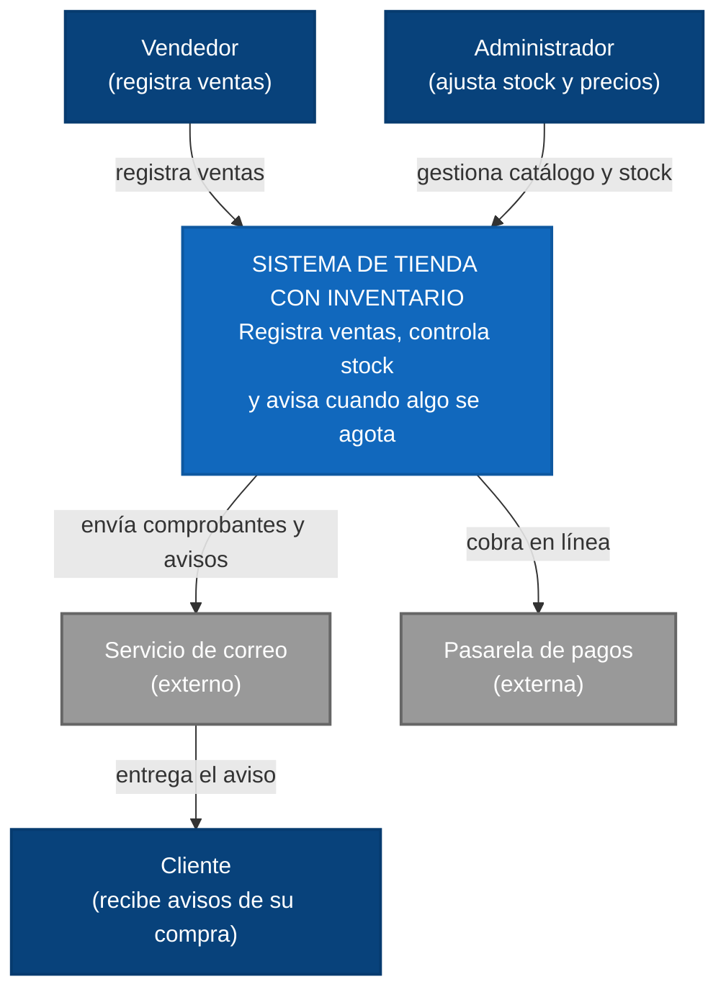

## Nivel 1 

```mermaid
graph TD
    classDef actor fill:#08427b,color:#fff,stroke:#073b6f,stroke-width:2px;
    classDef system fill:#1168bd,color:#fff,stroke:#0e58a0,stroke-width:2px;
    classDef external fill:#999999,color:#fff,stroke:#666666,stroke-width:2px;

    vendedor["Vendedor<br/>(registra ventas)"]:::actor
    admin["Administrador<br/>(ajusta stock y precios)"]:::actor
    cliente["Cliente<br/>(recibe avisos de su compra)"]:::actor

    sistema["SISTEMA DE TIENDA CON INVENTARIO<br/>Registra ventas, controla stock<br/>y avisa cuando algo se agota"]:::system

    correo["Servicio de correo<br/>(externo)"]:::external
    pasarela["Pasarela de pagos<br/>(externa)"]:::external

    vendedor -->|registra ventas| sistema
    admin -->|gestiona catálogo y stock| sistema
    sistema -->|envía comprobantes y avisos| correo
    correo -->|entrega el aviso| cliente
    sistema -->|cobra en línea| pasarela
```