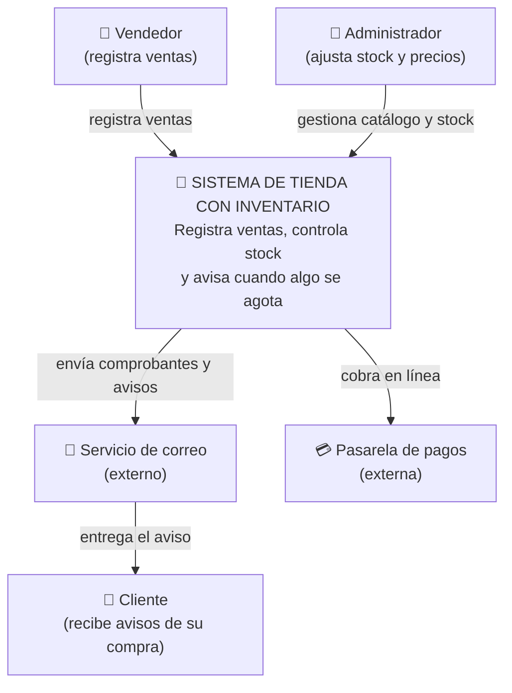

## Nivel 1 

```mermaid
flowchart TB
    vendedor["👤 Vendedor<br>(registra ventas)"]
    admin["👤 Administrador<br>(ajusta stock y precios)"]
    cliente["👤 Cliente<br>(recibe avisos de su compra)"]

    sistema["🛒 SISTEMA DE TIENDA CON INVENTARIO<br>Registra ventas, controla stock<br>y avisa cuando algo se agota"]

    correo["📧 Servicio de correo<br>(externo)"]
    pasarela["💳 Pasarela de pagos<br>(externa)"]

    vendedor -->|"registra ventas"| sistema
    admin -->|"gestiona catálogo y stock"| sistema
    sistema -->|"envía comprobantes y avisos"| correo
    correo -->|"entrega el aviso"| cliente
    sistema -->|"cobra en línea"| pasarela
```