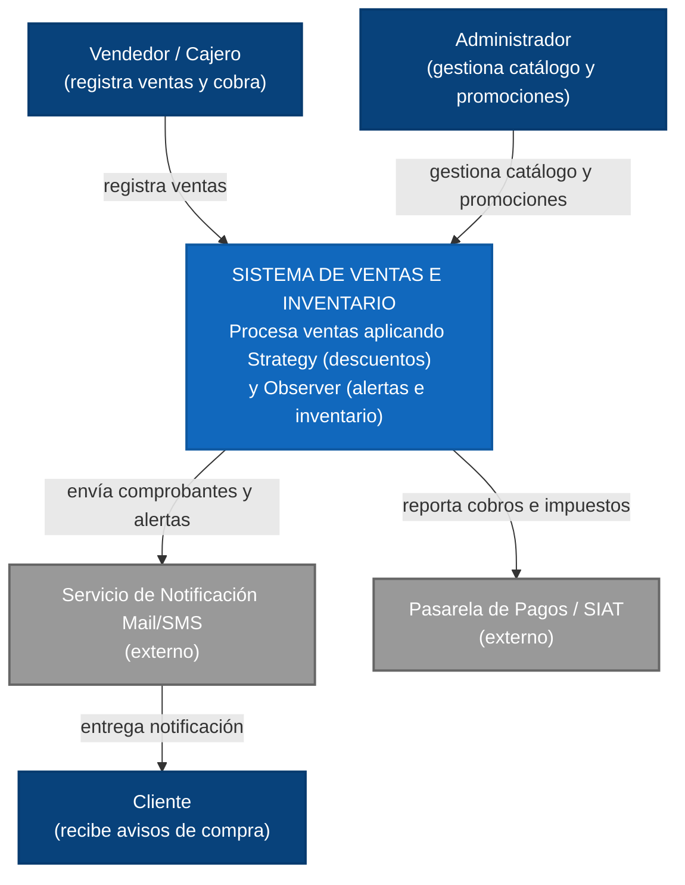
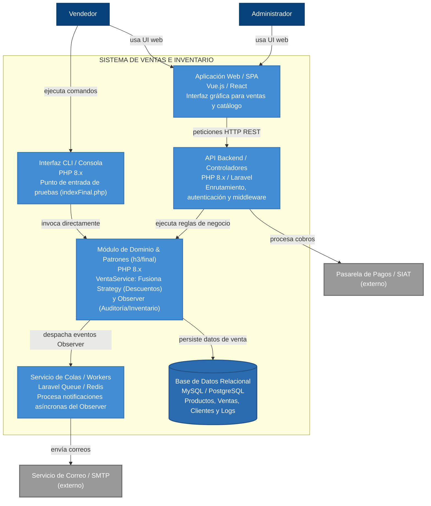

## Nivel 1 

```mermaid
graph TD
    classDef actor fill:#08427b,color:#fff,stroke:#073b6f,stroke-width:2px;
    classDef system fill:#1168bd,color:#fff,stroke:#0e58a0,stroke-width:2px;
    classDef external fill:#999999,color:#fff,stroke:#666666,stroke-width:2px;

    vendedor["Vendedor / Cajero<br/>(registra ventas y cobra)"]:::actor
    admin["Administrador<br/>(gestiona catálogo y promociones)"]:::actor
    cliente["Cliente<br/>(recibe avisos de compra)"]:::actor

    sistema["SISTEMA DE VENTAS E INVENTARIO<br/>Procesa ventas aplicando Strategy (descuentos)<br/>y Observer (alertas e inventario)"]:::system

    correo["Servicio de Notificación Mail/SMS<br/>(externo)"]:::external
    pasarela["Pasarela de Pagos / SIAT<br/>(externo)"]:::external

    vendedor -->|registra ventas| sistema
    admin -->|gestiona catálogo y promociones| sistema
    sistema -->|envía comprobantes y alertas| correo
    correo -->|entrega notificación| cliente
    sistema -->|reporta cobros e impuestos| pasarela
```

## Nivel 2

```mermaid
graph TD    
    classDef actor fill:#08427b,color:#fff,stroke:#073b6f,stroke-width:2px;
    classDef container fill:#438dd5,color:#fff,stroke:#3878b4,stroke-width:2px;
    classDef db fill:#2b6cb0,color:#fff,stroke:#205287,stroke-width:2px;
    classDef external fill:#999999,color:#fff,stroke:#666666,stroke-width:2px;

    vendedor["Vendedor"]:::actor
    admin["Administrador"]:::actor

    subgraph sistemaBoundary ["SISTEMA DE VENTAS E INVENTARIO"]
        webApp["Aplicación Web / SPA<br/>Vue.js / React<br/>Interfaz gráfica para ventas y catálogo"]:::container
        cliApp["Interfaz CLI / Consola<br/>PHP 8.x<br/>Punto de entrada de pruebas (indexFinal.php)"]:::container
        apiBackend["API Backend / Controladores<br/>PHP 8.x / Laravel<br/>Enrutamiento, autenticación y middleware"]:::container
        corePatrones["Módulo de Dominio & Patrones (h3/final)<br/>PHP 8.x<br/>VentaService: Fusiona Strategy (Descuentos)<br/>y Observer (Auditoría/Inventario)"]:::container
        queueWorker["Servicio de Colas / Workers<br/>Laravel Queue / Redis<br/>Procesa notificaciones asíncronas del Observer"]:::container
        db[("Base de Datos Relacional<br/>MySQL / PostgreSQL<br/>Productos, Ventas, Clientes y Logs")]:::db
    end

    correo["Servicio de Correo / SMTP<br/>(externo)"]:::external
    pasarela["Pasarela de Pagos / SIAT<br/>(externo)"]:::external

    vendedor -->|usa UI web| webApp
    vendedor -->|ejecuta comandos| cliApp
    admin -->|usa UI web| webApp

    webApp -->|peticiones HTTP REST| apiBackend
    cliApp -->|invoca directamente| corePatrones
    apiBackend -->|ejecuta reglas de negocio| corePatrones
    corePatrones -->|persiste datos de venta| db
    corePatrones -->|despacha eventos Observer| queueWorker
    queueWorker -->|envía correos| correo
    apiBackend -->|procesa cobros| pasarela
```